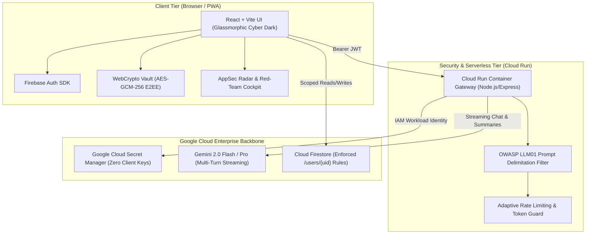

# AEGIS | Personal Gemini Journal & Zero-Knowledge MindVault
### Built for the APAC Ideathon — Production-Grade AI Security & Enterprise Directives

[](https://cloud.google.com/run)
[](https://firebase.google.com)
[](https://aistudio.google.com)
[](https://owasp.org/www-project-top-10-for-large-language-model-applications/)
[](#)

> Most generative AI applications fail in production due to hardcoded API keys, unauthenticated endpoints, and permissive database rules (`allow read, write: if true;`).
> **AEGIS** shifts security left by configuring **Google AI Studio** with an enterprise **Security Constitution** before a single line of code is written, shipping a hardened, production-grade journaling platform.

---

## 🌟 Flagship Innovations & Capabilities

### 1. 🛡️ MindVault (Zero-Knowledge Client-Side E2EE)
- Built natively using the browser **WebCrypto API**.
- Key derived using **PBKDF2 with 100,000 rounds of SHA-256** and user-unique cryptographic salt.
- Encrypts raw journal thoughts client-side with **AES-GCM-256** *before* persisting to Cloud Firestore.
- Even database administrators or compromised servers cannot decrypt thoughts without the user's passphrase.

### 2. 🌌 Cognitive Knowledge Mesh & Temporal Serendipity
- Powered by Gemini vector embeddings (`text-embedding-004`).
- Transforms personal journals into an interactive, physics-driven force-directed thought galaxy.
- Proactively surfaces **Temporal Serendipity Alerts**, connecting dilemmas today with breakthrough frameworks recorded weeks or months ago.

### 3. 🎯 AppSec Radar & Interactive Red-Team Testbed
- A real-time security cockpit displaying active tenant isolation health, Google Cloud Secret Manager key governance, and token expiration countdown.
- **Judges' Attack Simulation Suite**: Click to launch simulated **IDOR probes, prompt injection jailbreaks, and client credential scans**, witnessing live containment proofs and HTTP 403 / 200 signatures in real time.

---

## 🏛️ Architecture & Google Cloud Integration



---

## 🔒 Phase 1: Google AI Studio Security Constitution ("Aegis-1")

Configured directly inside **Google AI Studio System Instructions**:
* **Directive #1: Zero Exposed Secrets** — All Gemini API keys must reside in Google Cloud Secret Manager; zero keys in frontend bundles.
* **Directive #2: Zero-Trust Tenant Isolation** — Cloud Firestore rules must strictly validate `request.auth.uid == resource.data.userId`.
* **Directive #3: Cryptographic JWT Claims** — Server-side verification on all endpoints.
* **Directive #4: STRIDE Threat Modeling Before Code** — Threat models executed before any feature implementation.
* **Directive #5: OWASP Top 10 for LLMs Armor** — Strict XML delimiter boundaries `<user_journal_context>` protecting against jailbreaks and prompt injection.

*(Full specification available in [`docs/AI_STUDIO_CONSTITUTION.md`](docs/AI_STUDIO_CONSTITUTION.md))*.

---

## 🚀 Running Locally & Verification

```bash
# 1. Clone the repository
git clone https://github.com/Md-javid/personal-gemini-journal.git
cd personal-gemini-journal

# 2. Install dependencies
npm install

# 3. Build & start full stack
npm run build
npx tsx server/index.ts
```

Open [http://localhost:5173](http://localhost:5173) or [http://localhost:8080](http://localhost:8080) to interact with the application.

---

## 📜 License
MIT © 2026 APAC Ideathon Submission by Md Javid.
